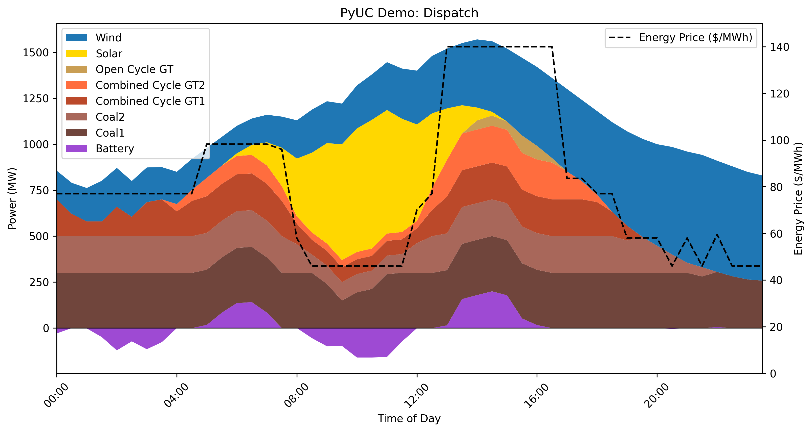

# PyUC: Stochastic unit commitment in python



## Overview
This model includes:
* Clustered unit commitment for numerical efficiency [1]. Instead of representing eight coal units with eight binary variables, a single integer variable is used. [1]
* Ability to include thermal generation, variable renewables and storage/batteries.
* Comprehensive set of unit commitment constraints:
    * Minimum stable generation
    * Minimum up and down times
    * Ramp constraints
    * Reserve and inertia requirements
* Ability to include a look-ahead period to better optimise decisions.

This model was original written GAMS in support of a doctoral thesis to model energy-only markets with increasing renewable
generation [2].

Planned features
* Generation of multiple uncertain wind, solar and demand scenarios using an auto-regressive moving average approach.
* Reserve pricing.
* Ability to run multiple days in series, using the end state (commitment status, stored energy, etc) of *day n* as the initial condition for day *n+1*.
* Generation expansion.
* Policy costs (carbon price, renewable energy certificate price, etc).

## Requirements
- PuLP with CBC solver.
- Pandas
- Matplotlib
- Numpy

## Getting started
A demonstration problem is available in the *demo_problem* directory, containing:
- half-hourly demand (*demand.csv*),
- wind and solar traces (*variable_traces.csv*),
- a range of unit types (*unit_data.csv*), including fuel costs and thermal efficiency, unit commitment constraints, battery properties, etc.


Constraints can be turned on/off using *constraint_list.csv*, and initial conditions
(such as initial energy stored in the battery and number of units on or offline) is in *initial_state.csv*.

Use the following snippet, or run *demo.py* from the *pyuc* main directory.
```python
from pyuc import pyuc
from visual import plots

input_data_path = "path/to/pyuc/demo_problem"
output_data_path = "path/to/pyuc/demo_problem"
name = "PyUC Demo"

pyuc.run_opt_problem(input_data_path, output_data_path, name=name)
plots.plot_dispatch(output_data_path, name=name, plot_price=True)
```

Results will be available under *demo_problem/results*, and the dispatch chart (above) under *demo_problem/charts*

## References
[1] Palmintier, Bryan Stephen. "Incorporating operational flexibility into electric generation planning: Impacts and methods for system design and policy analysis." PhD diss., Massachusetts Institute of Technology, 2013.

[2] Marshman, Daniel. "Performance of electricity markets & power plant investments in the transition to a low-carbon power system." The University of Melbourne (2018).

## License
This project is licensed under the GNU General Public License. See the [LICENSE](LICENSE) file for details.
